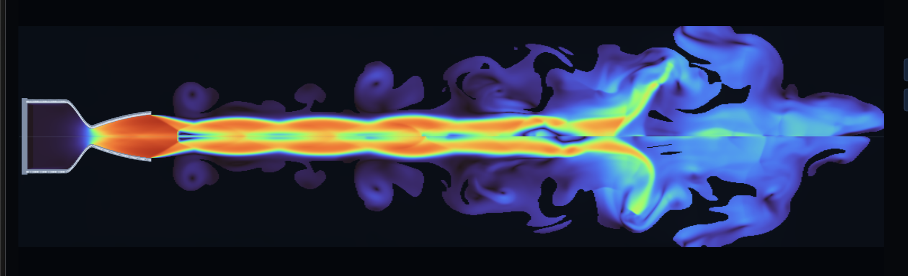
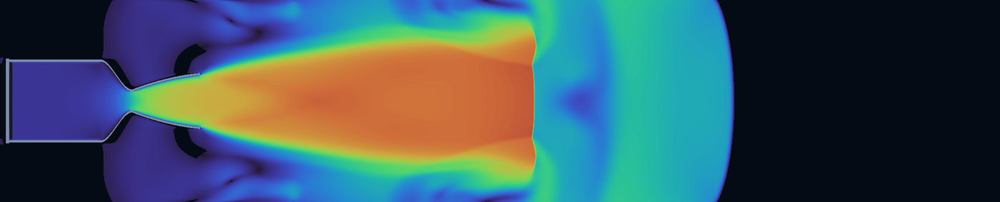
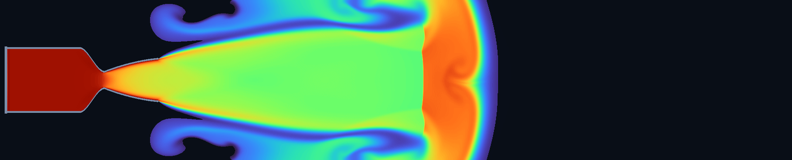
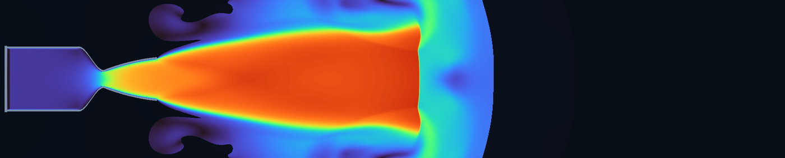

# RocketSim CFD

GPU-accelerated, axisymmetric rocket-nozzle and exhaust-plume simulation in C++20, Vulkan, and Dear ImGui.



RocketSim evolves a continuous compressible flow field—there are no display particles. It models nozzle startup, expansion waves, shock structures, plume boundaries, and the surrounding atmosphere on a long rectangular domain, with live controls and reusable high-resolution baking.

> [!IMPORTANT]
> RocketSim is an exploratory CFD and visualization project. It is not validated engine-design software and must not be used as a substitute for qualified analysis or hot-fire testing.

## Highlights

- Vulkan compute for live simulation, high-resolution baking, GIF generation, and long-duration validation.
- Axisymmetric inviscid Euler formulation with cylindrical geometric source terms and a physical reflective radial centerline.
- Limited second-order primitive reconstruction, HLLC shock-capturing fluxes, and two-stage SSP Runge–Kutta integration.
- Smooth converging and bell-like diverging nozzle geometry with analytic wall-normal reflection.
- Live views for Schlieren, temperature, Mach number, pressure, density, exhaust fraction, and velocity.
- `1x`, `2x`, and `3x` offline baking with progress, ETA, cached FFV1 fields, timeline scrubbing, and interrupted-bake recovery.
- Synchronized multi-field GIF export with independent playback speed and CFD sampling rate.
- Dear ImGui controls for gas state, ambient conditions, nozzle geometry, numerical settings, baking, and export.

## Field gallery

These frames are different views of the same transient startup flow. Field rendering is independent of the conserved simulation state, so switching views does not alter the CFD result.

<table>
  <tr>
    <td width="50%"><br><b>Mach number</b></td>
    <td width="50%"><br><b>Schlieren / density gradient</b></td>
  </tr>
  <tr>
    <td width="50%"><br><b>Static temperature</b></td>
    <td width="50%"><br><b>Velocity magnitude</b></td>
  </tr>
</table>

## Build and run

RocketSim is currently developed and tested on Apple silicon through Vulkan/MoltenVK. Install the dependencies with Homebrew:

```sh
brew install cmake vulkan-loader vulkan-headers molten-vk glfw ffmpeg
```

Then configure a release build and launch it:

```sh
git submodule update --init --recursive
cmake -S . -B build -DCMAKE_BUILD_TYPE=Release
cmake --build build -j
./build/rocketsim
```

`glslc` must be available because CMake compiles the CFD compute shader to SPIR-V. FFmpeg is required for bake caching and GIF export.

Run the CPU fallback, GPU solver, bake, and export checks with:

```sh
ctest --test-dir build --output-on-failure
```

## Simulation workflow

The right sidebar is one continuous scroll with four groups:

1. **Simulation** controls pause, reset, stepping, fast-forward, field selection, ambient conditions, CFL, and the live step budget.
2. **Engine** controls chamber pressure and temperature, frozen gas properties, and chamber/nozzle geometry.
3. **High-resolution bake** runs an asynchronous GPU solve, reports ETA, stores selected fields losslessly, and exposes the baked timeline.
4. **GIF export** writes one synchronized animation per selected field, either from a fresh GPU simulation or an existing bake cache.

On reset, a small chamber-head reservoir contains the hot working gas while the remaining chamber, nozzle, and exterior start at ambient conditions. The resulting pressure front travels through the chamber and throat before the external plume develops. This is an idealized sudden-start transient, not an injector spray or combustion model.

## Solver model

The production Vulkan path advances density, axial and radial momentum, total energy, and an exhaust-mixture scalar. The current model uses:

- axisymmetric, nonreacting, inviscid compressible flow;
- a calorically perfect gas with user-specified frozen `gamma` and molar mass;
- acoustic CFL timesteps;
- convective far-field boundaries;
- a sealed chamber head with a maintained internal reservoir;
- a default `768 × 288` live domain extending roughly ten metres beyond the nozzle.

The CPU implementation remains as a compact fallback and regression reference. Offline GPU jobs own separate headless Vulkan contexts, avoiding contention with the UI graphics queue.

## Baking and recovery

Bakes write selected fields to lossless FFV1 Matroska caches under `bakes/`, while lightweight RGB previews remain available for timeline scrubbing. Before starting, RocketSim estimates storage and preserves a 512 MB free-space reserve.

If a bake is interrupted—even if its Matroska trailer was never written—use **Recover latest interrupted bake** with the original capture interval. RocketSim scans complete frames in place and can export the recovered range without rerunning CFD.

Generated caches and exports are intentionally ignored by Git. Only representative PNG frames are kept in this repository.

## Fidelity boundary

RocketSim does not currently include a NASA CEA property deck, finite-rate chemistry, multiphase injection, viscosity, turbulence, wall heat transfer, regenerative cooling, real-gas behavior, or erosion. Displayed thrust and specific impulse are exploratory estimates.

The next major fidelity work is CEA-derived frozen properties, residual/convergence reporting, mesh-refinement controls, and validation against documented nozzle solutions and experimental data.

## Project layout

```text
shaders/    Vulkan CFD compute shaders
src/        solver, Vulkan backend, UI, baking, and export
tests/      CPU, GPU, bake, and GIF smoke tests
docs/       README images
third_party vendored Dear ImGui sources and license
```

Dear ImGui is included under its own MIT license in `third_party/imgui/LICENSE.txt`.
